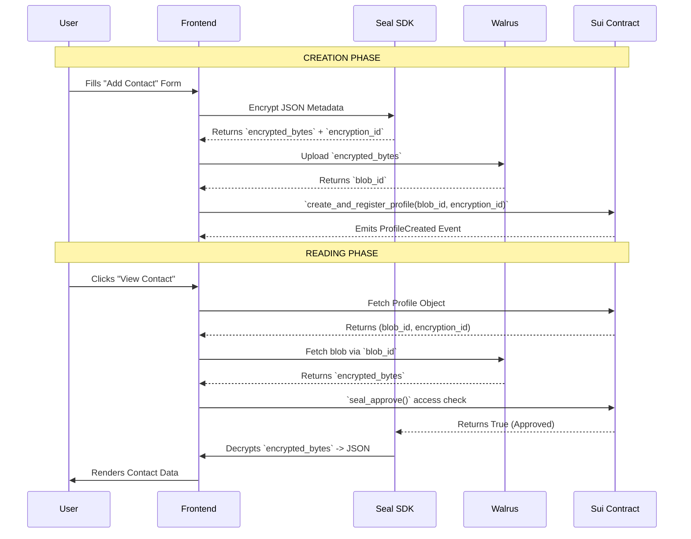

# SUI CRM - Data Architecture & Encrypted Storage Technical Flow

This document outlines the technical flow for how the Sui CRM orchestrates blockchain states (Sui), decentralized storage (Walrus), and encryption (Seal) to manage profiles and their sensitive data.

## The Problem: On-Chain Data Limits
Sui objects are ideal for access control, state management, and asset ownership. However, Sui is not designed to permanently store large text documents, PDF files, or extensive JSON arrays directly inside smart contracts. Doing so would incur massive gas fees. 

Furthermore, data stored natively on the Sui blockchain is **public** by default. A CRM absolutely needs privacy for user notes, interaction logs, and files.

## The Solution: The Hybrid Trio 
To solve this, the CRM uses three distinct systems working cohesively:

1. **Sui Blockchain**: The management layer. Controls "who owns what" and "who can access what" via robust Role-Based Access Control (RBAC).
2. **Walrus**: The storage layer. A decentralized blob storage network perfect for holding heavy data (JSON profiles, PDFs, text) cheaply.
3. **Seal**: The encryption layer. An encryption SDK that locks data *before* it gets sent to Walrus, ensuring that the decentralized data remains fully private.

---

## Technical Flow Breakdown

### 1. Creating a Contact Profile (The JSON Blob)

When a user sits at the frontend and creates a new "Contact", they are inputting metadata like:
- First Name, Last Name
- Twitter Handle
- Email
- Phone Number

**What actually happens:**
1. **Packaging**: The frontend bundles this data into a JSON object: `{"name": "Alice", "twitter": "@alice" ... }`.
2. **Encryption (Seal)**: The frontend passes this JSON payload to the Seal SDK. Seal encrypts the JSON and outputs two things:
   - `encrypted_bytes`: The unreadable, locked version of the JSON.
   - `encryption_id`: A unique key identifier used to decrypt it later.
3. **Storage (Walrus)**: The frontend takes the `encrypted_bytes` and uploads them to the Walrus network. Walrus returns a `blob_id`.
4. **On-Chain State (Sui)**: Finally, the frontend executes a smart contract call to `crm_access_control::create_and_register_profile`. It passes the `blob_id` and the `encryption_id` to the blockchain.

**Result:** The Sui `Profile` object acts simply as a lightweight "pointer". It holds the `wallet_address`, the `org_id`, the `blob_id` pointing to where the data lives, and the `encryption_id` pointing to the lock.

### 2. Reading a Contact Profile

When a user clicks on an existing Profile, the reverse engineered flow happens:
1. **Fetch Pointer**: Frontend queries the Sui blockchain for the `Profile` object to grab the `blob_id` and `encryption_id`.
2. **Fetch Encrypted Data**: Frontend queries Walrus using the `blob_id` to download the `encrypted_bytes`.
3. **On-Chain Verification**: The frontend asks Seal to decrypt the data. Seal executes a transaction calling `crm_access_control::seal_approve` on Sui. The Move contract verifies if the requester is an Admin, a Manager, or the Profile Owner.
4. **Decryption**: If `seal_approve` returns true, Seal decrypts the bytes back into the plaintext JSON object. The frontend renders "Alice" and "@alice".

---

## Visualizing the Architecture

